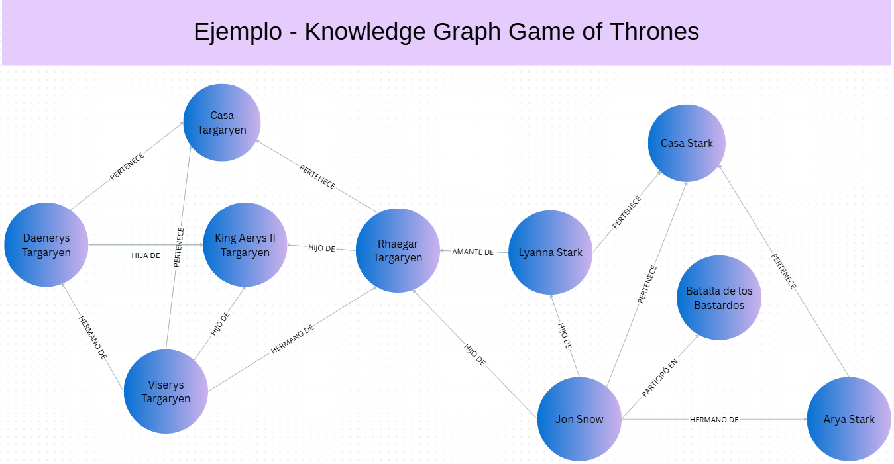
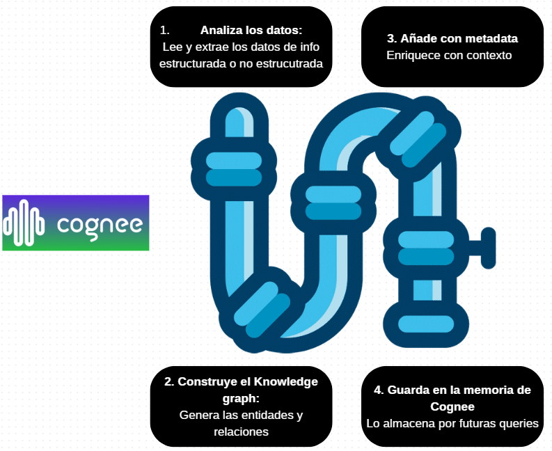

# 📘 Apuntes – Workshop 1

Conceptos previos

--- 
## Data Load Tool - dlt

`dlt` Es una librería open-source de Python diseñada para facilitar la construcción de pipelines ETL de forma sencilla y modular.

¿Qué hace *dlt*?
- **Extract**, obtiene datos de múltiples fuentes (APIs, base de datos, archivos csv, json, etc)
- **Transform**, transforma, limpia y normaliza los datos antes de cargarlos.
- **Load**, Carga los datos a diferentes destinos (DuckDB, BigQuery, etc)
- Maneja esquemas, estado y carga incremental


### Características claves

✅ Soporte para esquemas: Detecta y valida estructuras de datos automáticamente.

✅ Carga incremental: Solo actualiza los datos nuevos o modificados.

✅ Control de estado: Guarda el estado del pipeline para reinicios seguros.

✅ Transparente y reproducible: Puedes revisar y auditar lo que se carga en cada paso.

✅ Modular y extensible: Puedes construir pipelines complejos de forma progresiva.

---
## Grafo
Un grafo es una estructura de datos compuesta por:
- Nodos(nodes): representan entidades o conceptos (personas, lugares, cosas, etc).
    -  Ej: "Jon Snow", "Casa Stark", "Batalla de los Bastardos" 
- Aristas(edges): representan las relaciones entre nodos
- Etiquetas: describen el tipo de relación entre nodos
    - Ej: "pertenece a ", "hijo de", "participó en"

## knowledge Graph
Un grafo de conocimiento es un tipo de grafo que permite representar información de manera estructurada y semántica. En esencia, es una base de datos que conecta datos y organiza datos y forma una red interconectada de conocimiento.

De esta manera la información resulta fácil para consultar, navegar y entender.

### Ejemplo 



- Nodos: persona, casa, batallas
- Arista: representan relaciones entre nodos
- Etiquetas: "pertenece a ", "hijo de", "participó en", "hermano de"


### ¿Qué diferencia hay con Vector Search?
Vector search se basa en la búsqueda por similitud semántica, donde los documentos(bd) y la pregunta son convertidos a vectores(embeddings). Para poder almacenar estos vectores se usan vector stores como Qdrant, Pineconce, etc. 

Sin embargo, esta técnica no navega las relaciones explícitas entre entidades, sino que busca fragmentos de texto similares en significado con la consulta. 

📌 Ejemplo comparativo

`¿Qué hijo de Rhaegar Targaryen participó en la Batalla de los Bastardos?`

- Knowledge graph
EL sistema recorre las relaciones y respondería: Jon Snow

- Vector Search

Luego de realizar los pasos previos como chunking, embedding y carga a un vector store. 
Al hacer la pregunta, se busca el fragmento más cercano semánticamente, aunque no se entienda literalmente que Jon Snow es hijo de Rhaegar y partició en esa batalla.

### Tabla de comparación 

|  | knowledge Graph | Vector Search|
|--------|--------|-------------------|
| Se basa en | Entidades y relaciones explícitas | Similitud semántica entre vectores |
| Se basa en | ¿Quién es hijo de…? ¿Quién pertenece a…?| ¿Qué documento se parece a esta frase |
| Ideal para   | Razonamiento, relaciones complejas    | Búsquedas semánticas, RAG
| Herramientas | Cognee, Neo4j | Pinecone, Qdrant

### Comparación de flujo
- Vector Search: <p>
Documento → Chunking → Embeddings → Vector DB → Pregunta → Respuesta

- Knowledge Graph:<p>
Documento → Cognee → Grafo → Pregunta → Respuesta


Se ha mencionado Cognee como una herramienta para knowledge graph, entonces ...

---
## ¿Qué es cognee?
Extrae unidades y relaciones automáticamente desde tus datos (estructurados o no), y los transforma un knowledge graph que puedes consultar en lenguaje natural.

Entonces, en resumen permite: 
- Añadir data estructurada u no estructurada
- Identificar entidades y cómo se relacionan
- Construir automaticamente un knowledge graph
- Preguntar en lenguaje natural y recibir respuestas robustas. "¿Qué relación hay entre Daenerys y Jon Snow?"

¿Qué sucede cuando corres Cognee?



## ¿Qué son los Cognee Node Sets?
Los Node Sets en Cognee son grupos de nodos etiquetados dentro del grafo de conocimiento.
Cada nodo set está definido por una lista de tags (cadenas de texto) asociadas al contenido que representan.

💡 Piensa en los Node Sets como “carpetas temáticas” dentro de tu grafo, que agrupan información por tópicos o dominios.

### ¿Para qué sirven?
Los Node Sets permiten organizar, filtrar y consultar la información de forma más eficiente y estructurada a medida que el conocimiento crece.

### Ventajas principales

| Ventaja                       | Explicación                                                                                            |
| ----------------------------- | ------------------------------------------------------------------------------------------------------ |
| 🧩 **Aislamiento por tópico** | Puedes leer o escribir datos separados por dominio o tema (ej. “historia”, “personajes”)               |
| 🗂️ **Mejor organización**    | Mantienes tu grafo ordenado a medida que añades más contenido                                          |
| 🎯 **Mejor recuperación**     | Permite hacer consultas más precisas filtrando por etiquetas o tags                                    |
| 📊 **Análisis por tema**      | Facilita detectar patrones dentro de un tópico específico (por ejemplo, relaciones dentro de una casa) |
| 📈 **Escalabilidad**          | Reduce la complejidad al dividir el grafo en subconjuntos lógicos                                      |

### Ejemplo
Node Set: "Casa Stark"
- Arya Stark
- Jon Snow
- Sansa Stark

Node Set: "Casa Targaryen"
- Daenerys
- Rhaegar
- King Aerys II


### Backend compatible: Kuzu
- Motor de base de datos gráfica optimizada
- Ligero, rápido y open-source
- Compatible con Node Sets
- Usado por Cognee como motor para consultar relaciones complejas de forma eficiente

## Kuzu

Kuzu es una base de datos de grafos embebible y de alto rendimiento, diseñada para tareas de consulta intensiva con estructuras altamente conectadas (como los knowledge graphs).

### Características de Kuzu:
- Open-source
- Diseñada para ser rápida y ligera
- Muy buena para consultas locales complejas
- Usa su propio motor de consultas (parecido a Cypher)

### Relación con Cognee:
Cognee puede usar Kuzu como **motor backend** para almacenar y consultar sus grafos.
Esto significa que los Node Sets se pueden **gestionar** y **consultar** directamente sobre **Kuzu**, además de otras opciones como **Neo4j**.

```
Cognee te abstrae la complejidad: tú defines el contenido y las relaciones, y Kuzu se encarga del almacenamiento y consultas optimizadas.
```


## Recursos

- [Workshop - LLM Zoomcamp](https://www.youtube.com/watch?v=MNt_KK32gys&ab_channel=DataTalksClub%E2%AC%9B)
- [Dlt repo oficial](https://github.com/dlt-hub/dlt)
- [Moving Data with Python and dlt: A Guide for Data Engineers](https://www.datacamp.com/tutorial/python-dlt)
- [Cognee](https://www.youtube.com/watch?v=1bezuvLwJmw)